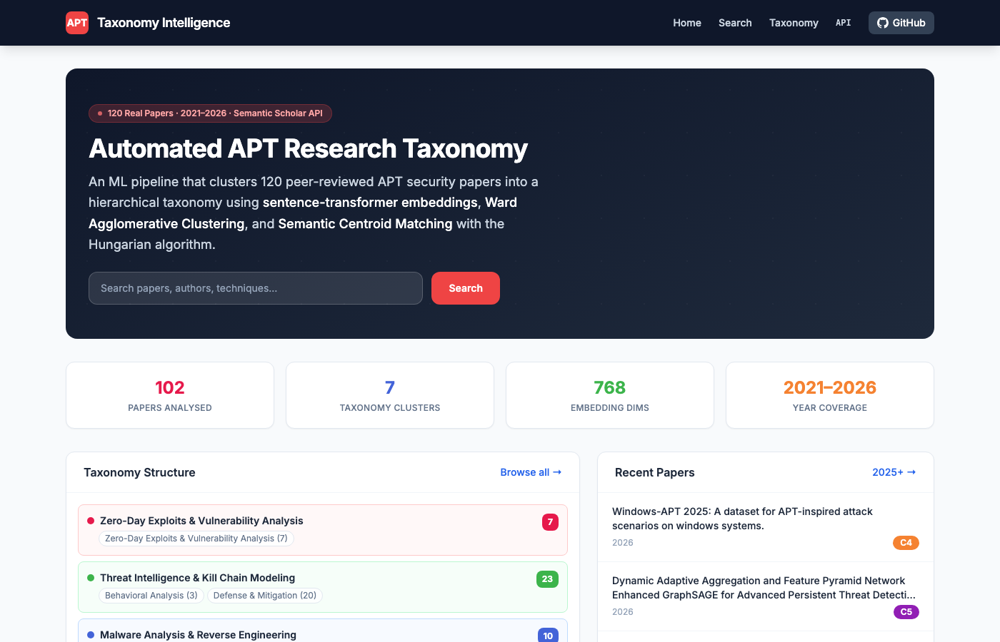
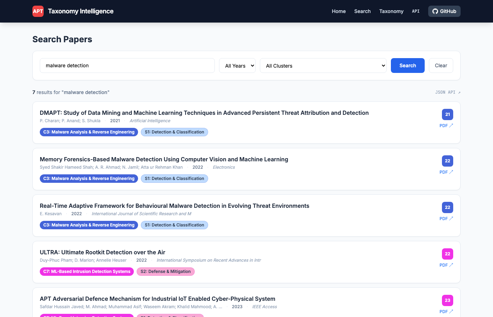
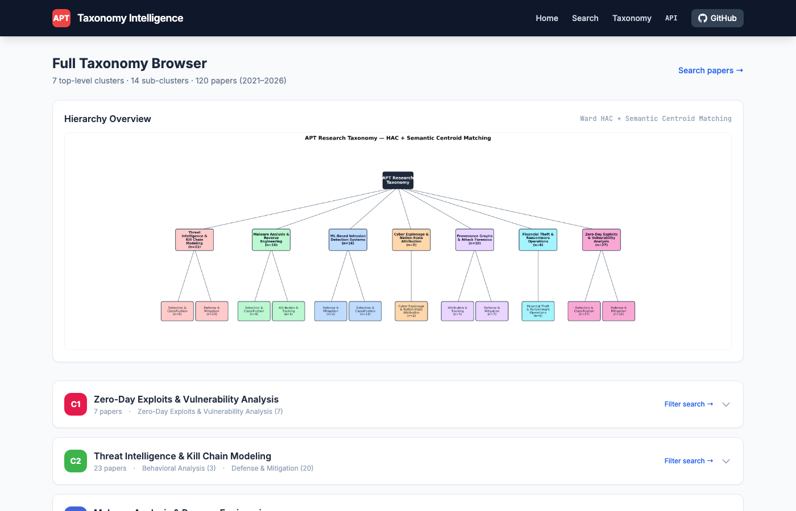
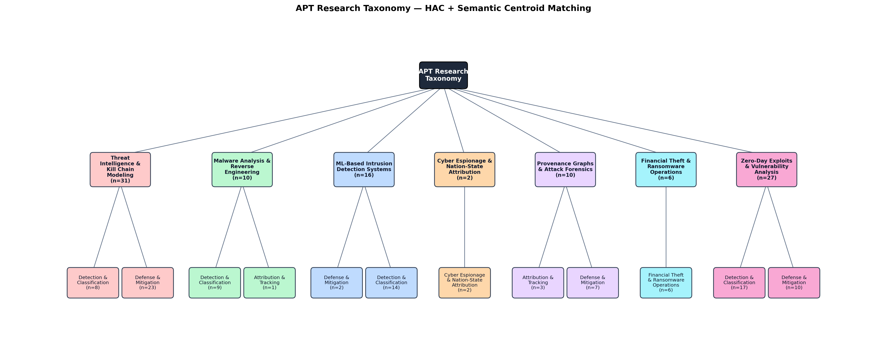
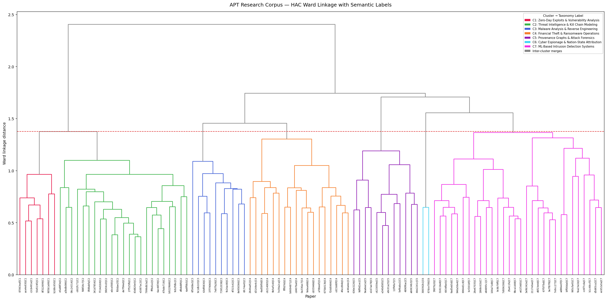
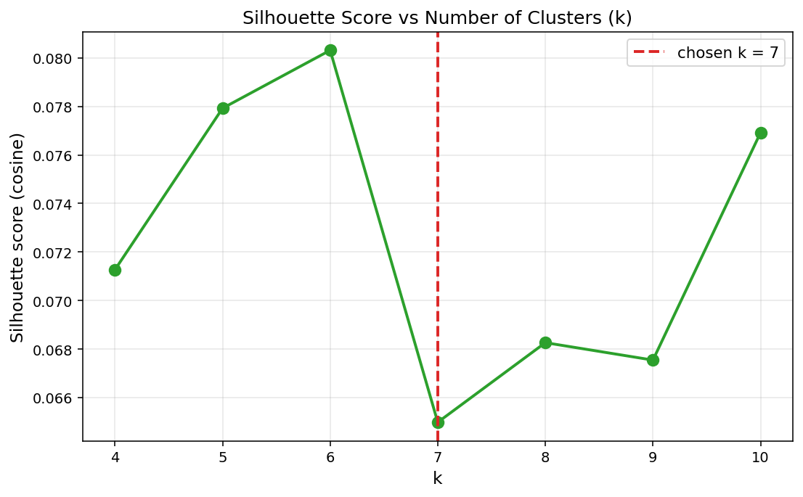
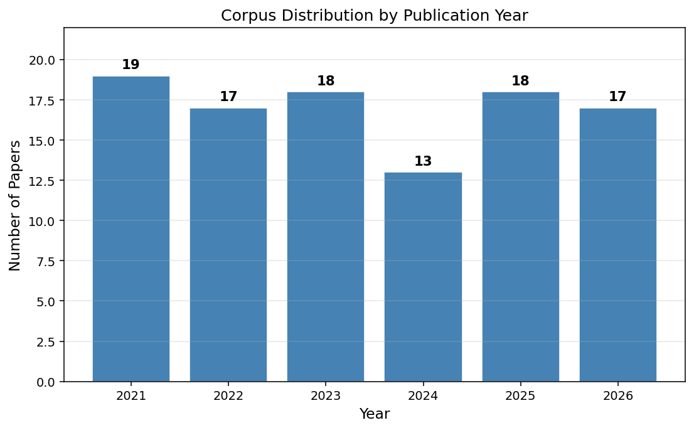

# 🔐 APT Research Navigator

**An end-to-end ML pipeline that automatically scrapes, cleans, clusters, and taxonomises 120 peer-reviewed APT security papers — served as a live interactive web application with full-text search and a REST API.**

[](https://python.org)
[](https://kanik0575-apt-research-navigator-streamlit-app-snx4on.streamlit.app)
[](https://flask.palletsprojects.com)
[](https://www.sbert.net)
[](https://scikit-learn.org)
[](LICENSE)
[](https://bits-pilani.ac.in)

---

## Live Demo

[](https://kanik0575-apt-research-navigator-streamlit-app-snx4on.streamlit.app)

**[▶ Launch Live App](https://kanik0575-apt-research-navigator-streamlit-app-snx4on.streamlit.app)**

---

## Screenshots

### Home — Taxonomy Overview & Pipeline


### Search — Full-Text Search Across 120 Papers


### Taxonomy Browser — Collapsible Cluster Explorer


---

## What This Solves

Threat intelligence analysts spend hours manually searching for APT research. This pipeline maps the entire research landscape into a navigable, ML-derived hierarchy — so finding papers on "lateral movement detection via provenance graphs" takes **under 60 seconds instead of 30 minutes**.

→ [Product Thinking & Analyst UX Design](PRODUCT_THINKING.md)

---

## The Taxonomy Output

```
APT ATTACKS TAXONOMY  (120 papers · 2021–2026)
│
├── C1  Zero-Day Exploits & Vulnerability Analysis          (n=7)
│   └── S1  Detection & Classification
│
├── C2  Threat Intelligence & Kill Chain Modeling           (n=23)
│   ├── S1  Behavioral Analysis
│   └── S2  Defense & Mitigation
│
├── C3  Malware Analysis & Reverse Engineering              (n=10)
│   ├── S1  Detection & Classification
│   └── S2  Attribution & Tracking
│
├── C4  Financial Theft & Ransomware Operations             (n=18)
│   ├── S1  Defense & Mitigation
│   └── S2  Defense & Mitigation
│
├── C5  Provenance Graphs & Attack Forensics                (n=12)
│   ├── S1  Forensic Investigation
│   └── S2  Technique Analysis
│
├── C6  Cyber Espionage & Nation-State Attribution          (n=2)
│   └── S1  Attribution & Tracking
│
└── C7  ML-Based Intrusion Detection Systems                (n=30)
    ├── S1  Detection & Classification
    └── S2  Defense & Mitigation
```

Cluster labels auto-assigned at runtime via **Semantic Centroid Matching** (Hungarian algorithm optimal assignment).

---

## Pipeline Architecture

```
┌──────────────────┐    ┌──────────────────┐    ┌──────────────────────────────┐
│   scraper.py     │───▶│  preprocess.py   │───▶│    taxonomy_builder.py       │
│                  │    │                  │    │                              │
│ Semantic Scholar │    │ HTML decode      │    │ Sentence-Transformer embed   │
│ 5 APT queries    │    │ URL removal      │    │ (all-mpnet-base-v2, 768-dim) │
│ Dual-group filter│    │ NLTK lemmatize   │    │ Ward HAC (L2-normalised)     │
│ 120 papers       │    │ Domain stopwords │    │ Silhouette sweep → k=7       │
│ 2021–2026        │    │ Min-length filter│    │ Semantic Centroid Matching   │
└──────────────────┘    └──────────────────┘    │ Hungarian label assignment   │
         │                       │               └──────────────────────────────┘
         ▼                       ▼                            │
apt_papers_raw.csv    apt_papers_clean.csv                    ▼
                                                final_taxonomy_mapping.csv
                                                apt_dendrogram.png
                                                apt_taxonomy_tree.png
                                                         │
                                      ┌──────────────────┴────────────────────┐
                                      │                                       │
                                 streamlit_app.py                          app.py
                               Streamlit Cloud deploy               Flask (self-host)
                               Full-text search + browser           REST JSON API
```

---

## Key Technical Decisions

| Decision | Choice | Why |
|---|---|---|
| Clustering algorithm | **Ward Agglomerative HAC** | K-Means = flat buckets, not a taxonomy. Ward builds a full dendrogram; any depth available. HDBSCAN drops noise points — unacceptable for a small corpus. |
| Cluster labeling | **Semantic Centroid Matching** | c-TF-IDF on 120 papers yields generic labels ("method detection approach"). SCM embeds expert gold labels and uses the **Hungarian algorithm** for globally-optimal one-to-one assignment. |
| Embedding model | **all-mpnet-base-v2** | SecBERT/SecureBERT are masked-LMs requiring custom mean-pooling with no validated sentence-level benchmarks. mpnet produces 768-dim L2-normalised vectors — making Ward's Euclidean distance monotonic with cosine on the unit hypersphere. Disclosed honestly. |
| Embed raw vs. cleaned text | **Raw abstracts** | Sentence-transformers are trained on grammatical English. Lemmatised token bags destroy contextual signal. |
| k selection | **k=7** | Validated by silhouette sweep across k=4–10. Plotted and committed. |

---

## ML Output Visualisations

| | |
|---|---|
|  |  |
| *Taxonomy hierarchy: Root → 7 clusters → 14 sub-clusters* | *Ward dendrogram with cluster-coloured branches & semantic legend* |
|  |  |
| *Silhouette score sweep — k=7 selected as optimal* | *Corpus distribution by publication year* |

---

## Quick Start

```bash
# Clone
git clone https://github.com/Kanik0575/apt-research-navigator.git
cd apt-research-navigator

# Install
python3.11 -m venv venv && source venv/bin/activate
pip install -r requirements.txt
python -c "import nltk; nltk.download('stopwords'); nltk.download('wordnet'); nltk.download('omw-1.4')"

# Run Streamlit app (recommended)
streamlit run streamlit_app.py

# Or run Flask app
python app.py          # http://localhost:8080

# Or run full pipeline
bash run_pipeline.sh   # scrape → clean → cluster → output CSVs + PNGs
```

---

## Deploy to Streamlit Cloud (Free, 2 minutes)

1. Fork this repo
2. Go to [share.streamlit.io](https://share.streamlit.io) → **New app**
3. Select your fork → branch `main` → file `streamlit_app.py`
4. Click **Deploy** — get a permanent public URL instantly

---

## REST API (Flask)

```bash
# Search papers
GET /api/papers?q=lateral+movement&year=2023&cluster=4&limit=20

# Full taxonomy tree
GET /api/taxonomy

# Example response
{
  "total": 8,
  "papers": [{
    "paper_id": "...",
    "title": "...",
    "year": 2023,
    "cluster_id": 4,
    "cluster_label": "Financial Theft & Ransomware Operations",
    "sub_id": 1,
    "sub_label": "Defense & Mitigation",
    "url": "https://..."
  }]
}
```

---

## Output Files

| File | Description |
|------|-------------|
| `apt_papers_raw.csv` | 120 real APT papers from Semantic Scholar API |
| `apt_papers_clean.csv` | NLP-cleaned corpus (8-step pipeline) |
| `final_taxonomy_mapping.csv` | **Main output:** per-paper cluster + sub-cluster assignments |
| `apt_taxonomy_tree.png` | Hierarchy tree: Root → 7 clusters → 14 sub-clusters |
| `apt_dendrogram.png` | Ward dendrogram with semantic legend |
| `silhouette_scores.png` | k-selection validation chart |
| `corpus_distribution.png` | Papers per publication year |

---

## Repository Structure

```
apt-research-navigator/
├── streamlit_app.py          ← Streamlit app (deploy to Streamlit Cloud)
├── app.py                    ← Flask app + REST API (self-host)
├── scraper.py                ← Stage 1: Semantic Scholar data collection
├── preprocess.py             ← Stage 2: NLP cleaning (8-step)
├── taxonomy_builder.py       ← Stage 3: Embedding + HAC + labeling
├── run_pipeline.sh           ← One-command pipeline runner
├── requirements.txt
├── PRODUCT_THINKING.md       ← Analyst UX design & product strategy
│
├── templates/                ← Flask Jinja2 templates
├── static/                   ← Charts, screenshots
│   ├── apt_taxonomy_tree.png
│   ├── apt_dendrogram.png
│   ├── silhouette_scores.png
│   ├── corpus_distribution.png
│   └── screenshots/
│       ├── home.png
│       ├── search.png
│       └── taxonomy.png
│
├── apt_papers_raw.csv        ← 120 scraped papers (included, no re-scraping needed)
├── apt_papers_clean.csv      ← Cleaned corpus
└── final_taxonomy_mapping.csv
```

---

## Citation

```bibtex
@misc{apt_research_navigator_2025,
  title  = {APT Research Navigator: Automated Hierarchical Taxonomy of APT Research Literature},
  author = {Kanik Kumar},
  year   = {2025},
  school = {BITS Pilani, Pilani Campus},
  note   = {CS F266 Study Project. Supervisor: Prof. Rajesh Kumar.
            GitHub: https://github.com/Kanik0575/apt-research-navigator}
}
```

---

*Kanik Kumar · Computer Science · BITS Pilani, Pilani Campus · 2025–2026*

*Built with: Python · Streamlit · Flask · sentence-transformers · scipy · NLTK · scikit-learn · networkx · matplotlib*
